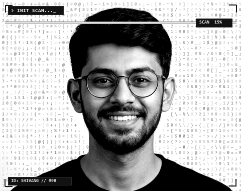
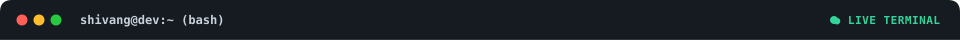
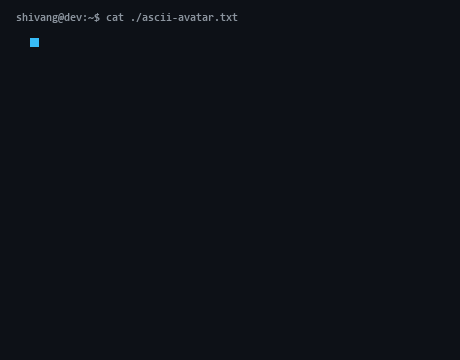
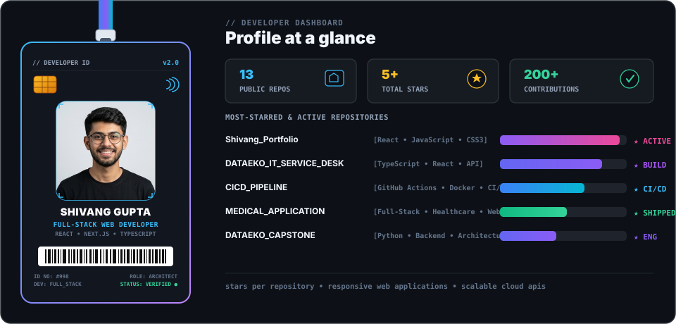
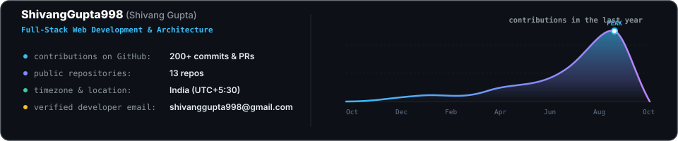
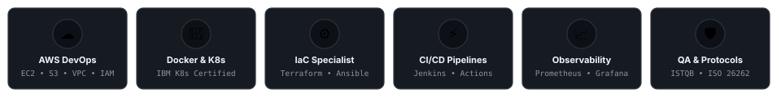

<!-- ==================== MASTER TERMINAL CARD ==================== -->
<table border="0" width="100%" cellspacing="0" cellpadding="0" style="max-width: 960px; border-collapse: collapse; border: 1.5px solid #D4D4D4; border-radius: 12px; overflow: hidden; background: #FFFFFF;">
  <!-- Window Titlebar -->
  <tr>
    <td colspan="2" style="padding: 0; margin: 0; line-height: 0;">
      
    </td>
  </tr>
  <!-- Content Body: 42% Portrait / 58% Dashboard -->
  <tr>
    <td width="42.4%" valign="top" style="padding: 6px; margin: 0; border-right: 1.5px solid #E5E5E5; background: #FFFFFF;">
      <!-- Real Photo Biometric Scanning Animation -->
      
    </td>
    <td width="57.6%" valign="top" style="padding: 6px; margin: 0; background: #FFFFFF;">
      <!-- Terminal Dashboard -->
      
    </td>
  </tr>
</table>

 

<!-- Quick Interactive Action Links -->

  
  
  
  
  

---

<!-- ==================== SECTION 1: LIVE TERMINAL & ANIMATED ASCII PORTRAIT (50:50) ==================== -->

<table border="0" width="100%" cellspacing="0" cellpadding="0" style="max-width: 960px; border-collapse: collapse; border: 1.5px solid #30363D; border-radius: 12px; overflow: hidden; background: #0D1117;">
  <!-- Live Terminal Titlebar -->
  <tr>
    <td colspan="2" style="padding: 0; margin: 0; line-height: 0;">
      
    </td>
  </tr>
  <!-- 50:50 Split: Left CLI Sequence / Right Animated ASCII Art Portrait -->
  <tr>
    <td width="50%" valign="top" style="padding: 6px 12px; margin: 0; border-right: 1.5px solid #21262D; background: #0D1117;">
      
    </td>
    <td width="50%" valign="middle" align="center" style="padding: 0; margin: 0; background: #0D1117;">
      
    </td>
  </tr>
</table>

---

<!-- ==================== SECTION 2: DEVELOPER ID CARD & DASHBOARD ==================== -->

---

<!-- ==================== SECTION 3: PLANETARY TECH STACK ORBIT ==================== -->

 

<!-- Official Brand Icon Grid (Devicon / SkillIcons) -->

  
<code>shivang@dev:~$ ./skills --icons</code>

  

---

<!-- ==================== SECTION 4: FEATURED BUILDS ==================== -->
### `shivang@dev:~$ ls -la ./projects`

<table border="0" width="100%" cellspacing="0" cellpadding="8">
  <tr>
    <td width="50%" valign="top">
      

        <h4>🌐 <a href="https://github.com/ShivangGupta998/Shivang_Portfolio" style="color: #58A6FF;">Shivang_Portfolio</a></h4>
        
Modern responsive personal developer portfolio showcasing full-stack projects, responsive interactive interfaces, smooth animations, and clean component architecture.

        

          <code>React</code> <code>JavaScript</code> <code>CSS3</code> <code>UI/UX</code>
        

        
🔗 <a href="https://github.com/ShivangGupta998/Shivang_Portfolio" style="color: #58A6FF; font-weight: bold;">Explore Repository →</a>

      

    </td>
    <td width="50%" valign="top">
      

        <h4>⚡ <a href="https://github.com/ShivangGupta998/DATAEKO_IT_SERVICE_DESK" style="color: #58A6FF;">DATAEKO_IT_SERVICE_DESK</a></h4>
        
Comprehensive enterprise IT service desk platform for support ticket routing, real-time status management, automated SLA monitoring, and developer workflow tracking.

        

          <code>TypeScript</code> <code>React</code> <code>REST API</code> <code>Tailwind</code>
        

        
🔗 <a href="https://github.com/ShivangGupta998/DATAEKO_IT_SERVICE_DESK" style="color: #58A6FF; font-weight: bold;">Explore Repository →</a>

      

    </td>
  </tr>
  <tr>
    <td width="50%" valign="top">
      

        <h4>🚀 <a href="https://github.com/ShivangGupta998/CICD_PIPELINE" style="color: #58A6FF;">CICD_PIPELINE</a></h4>
        
Continuous integration and continuous deployment engine leveraging GitHub Actions, automated Docker builds, test execution pipelines, and automated cloud delivery.

        

          <code>GitHub Actions</code> <code>Docker</code> <code>CI/CD</code> <code>DevOps</code>
        

        
🔗 <a href="https://github.com/ShivangGupta998/CICD_PIPELINE" style="color: #58A6FF; font-weight: bold;">Explore Repository →</a>

      

    </td>
    <td width="50%" valign="top">
      

        <h4>🏥 <a href="https://github.com/ShivangGupta998/MEDICAL_APPLICATION" style="color: #58A6FF;">MEDICAL_APPLICATION</a></h4>
        
Full-stack healthcare and clinic management web solution enabling appointment bookings, patient record administration, schedule coordination, and responsive physician dashboards.

        

          <code>Full-Stack</code> <code>JavaScript</code> <code>Healthcare</code> <code>Web App</code>
        

        
🔗 <a href="https://github.com/ShivangGupta998/MEDICAL_APPLICATION" style="color: #58A6FF; font-weight: bold;">Explore Repository →</a>

      

    </td>
  </tr>
</table>

---

<!-- ==================== SECTION 5: GITHUB ANALYTICS & ACTIVITY WAVE ==================== -->
### `shivang@dev:~$ ./analytics --overview`

<!-- Contribution Wave Graph -->

  

<!-- GitHub Streak Stats -->

  

<!-- Dual Stats & Top Languages -->
<table border="0" width="100%">
  <tr>
    <td width="50%" align="center" valign="middle">
      
    </td>
    <td width="50%" align="center" valign="middle">
      
    </td>
  </tr>
</table>

 

<!-- GitHub Trophies & Achievements Matrix -->

---

<!-- ==================== SECTION 6: CONNECT & FOOTER ==================== -->

### `shivang@dev:~$ ./connect`

<h3>LET'S BUILD SOMETHING TOGETHER</h3>

  
  
  
  

  "Building, learning, and exploring the possibilities of technology — one commit at a time."

